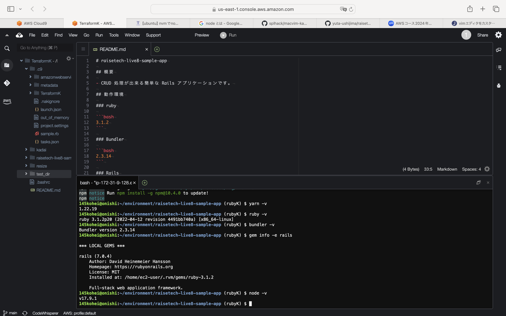
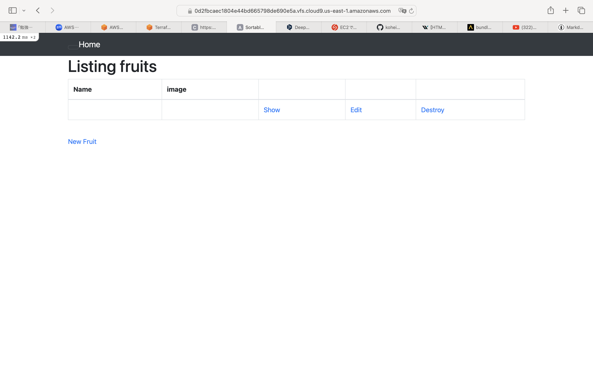
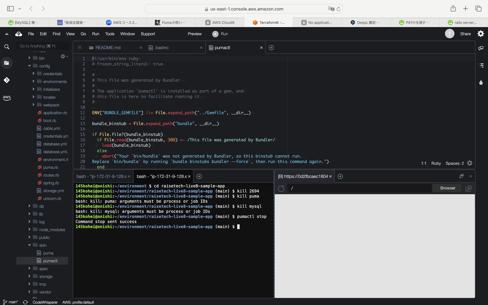
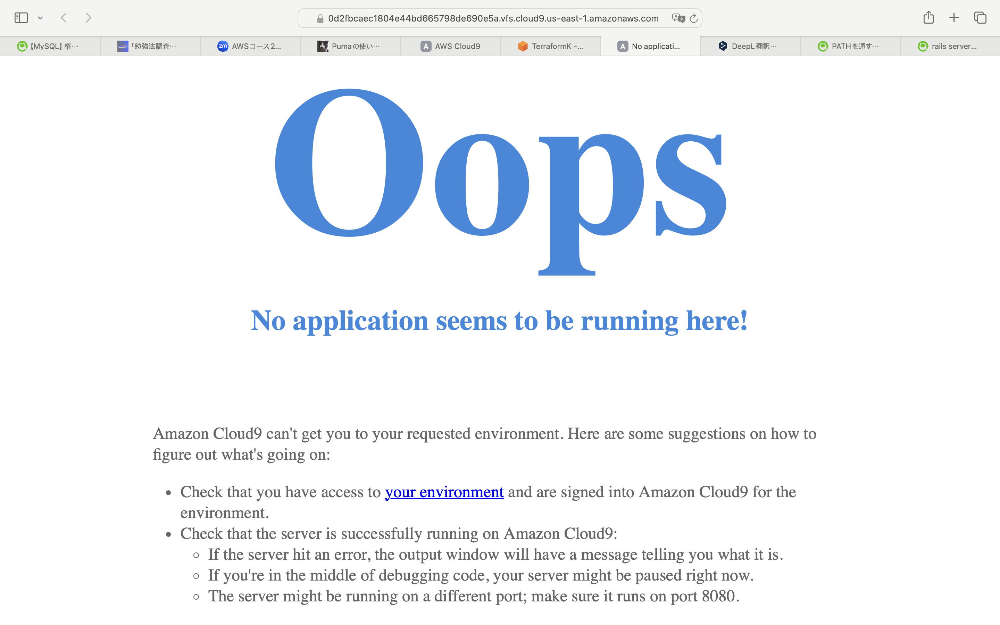
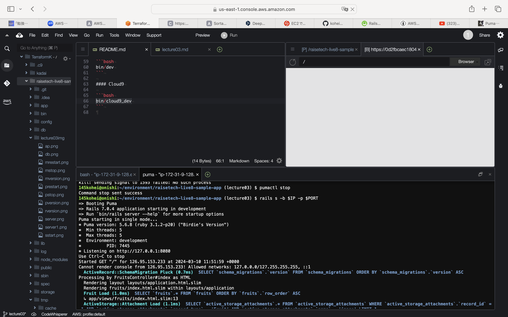
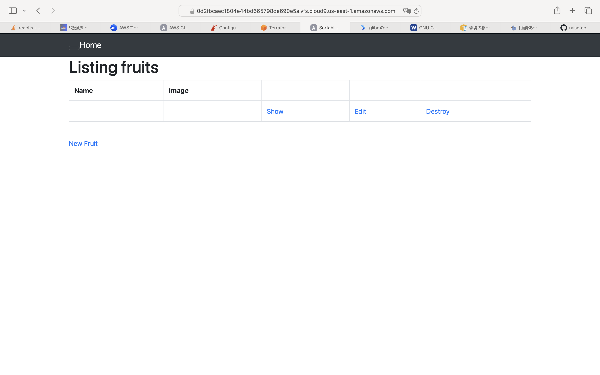
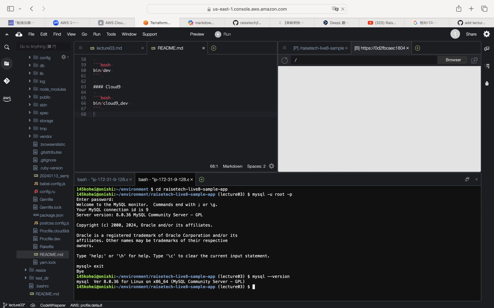
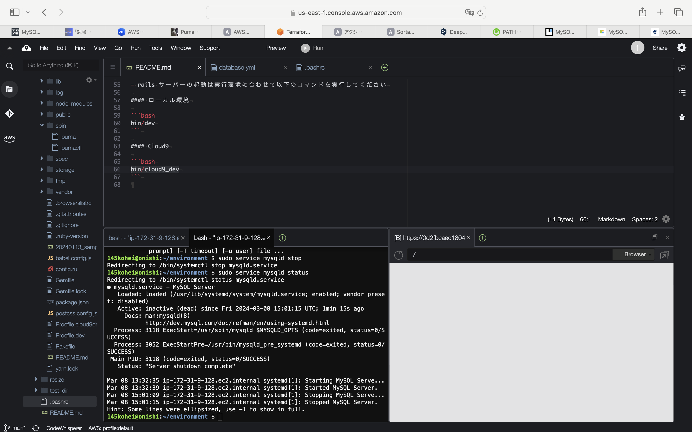
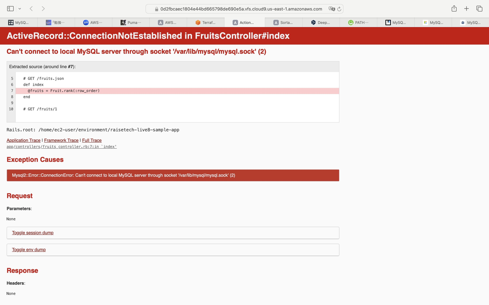
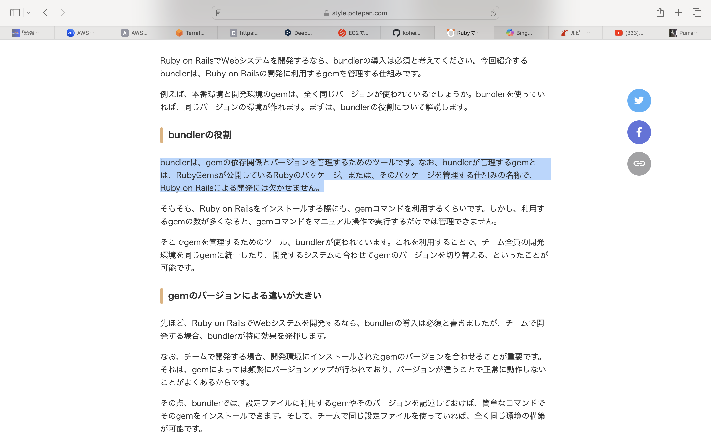

# 第3回課題

## デプロイ作業  
  - 各バージョンインストール
    
  - サーバーを起動
    
  - アクセス画面
  

## APサーバーについて調べる。  
  - APサーバーの名前とバージョン  
  Puma version: 5.6.8 (ruby 3.1.2-p20) ("Birdie's Version")  
    
  - APサーバーを終了させた場合、引き続きアクセスできるか？  
    →**アクセス出来ない。**  
    
  
  - 再起動後サーバーにアクセス
  
  

## DBサーバーについて調べる。  
  - サンプルアプリケーションで使用したDBサーバーの名前とバージョン。  
  MySQL  Ver 8.0.36 for Linux on x86_64 (MySQL Community Server - GPL)  
    
  - DBサーバーを終了させた場合、引き続きアクセスできるか？  
　　 →**アクセス出来ない。**    
    
    
  - Railsの構成管理ツールの名前は？  
  Bundler  
  

## 今回の課題から学んだこと感じたこと。  
覚えることが多く、LinuxやMySQLについて基礎から学びました。  
バージョンインストールやデプロイ方法が上手くいかず、調べても分からないことが多々ありました。  
質問では調べ方について指摘があり、どう調べたら良いかなどアドバイスを頂き、無事作業が完了しました。  
今回の課題では作業の進め方だけでなく、躓いた時にどう調べたら良いか、どう質問をすれば良いかなど、
多くを学べました。
