# 第4回課題

## 1. AWS上に新しくVPCを作成 
  - 東京リージョンでVPCを作成。
  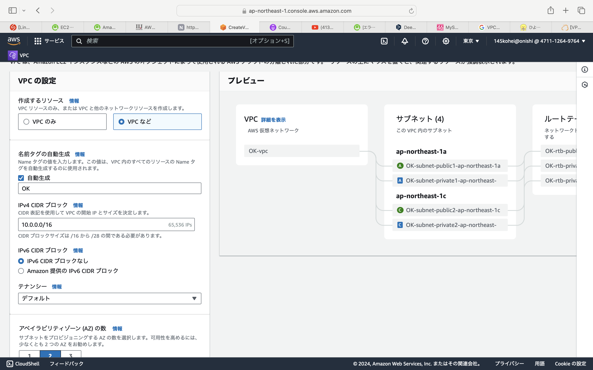  
  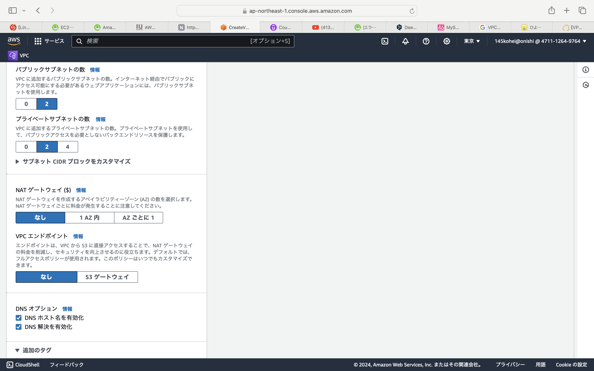  

## 2. EC2の作成  
  - Amazon Linux2AMIを選択。
  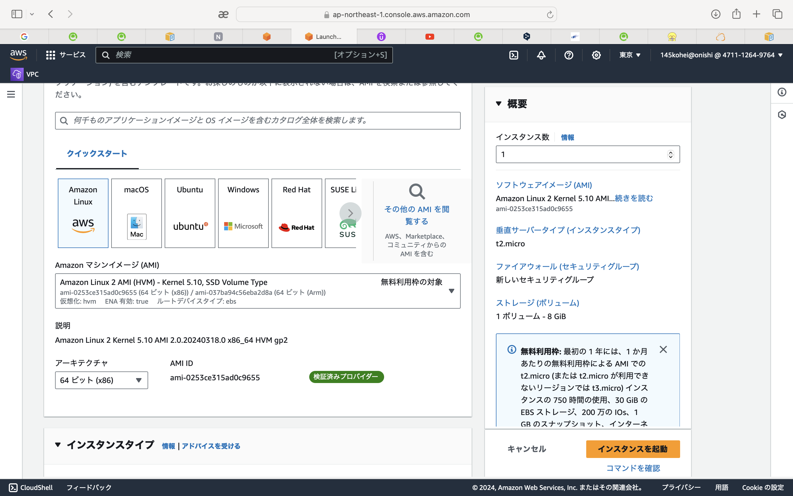  
  - t2.microを選択。キーペアを作成。
  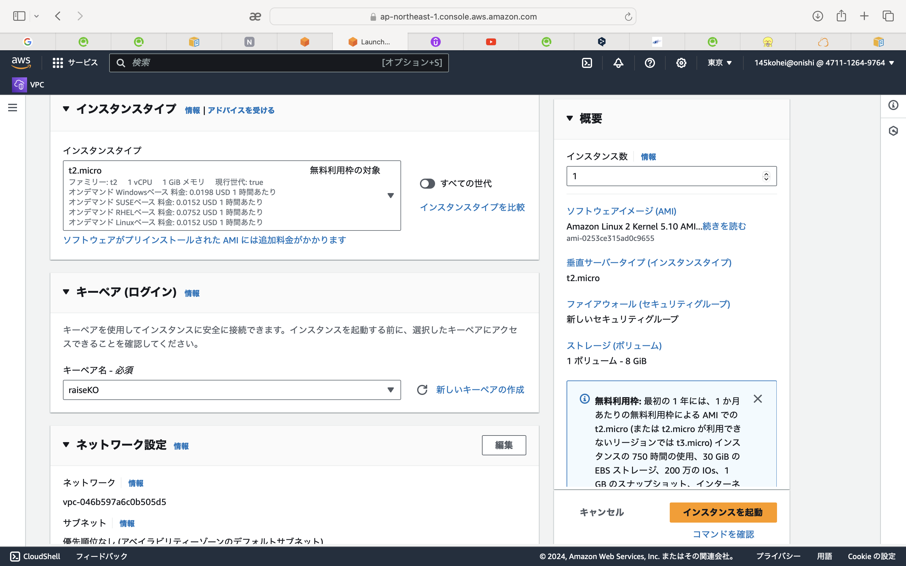
  - セキュリティグループを作成。
  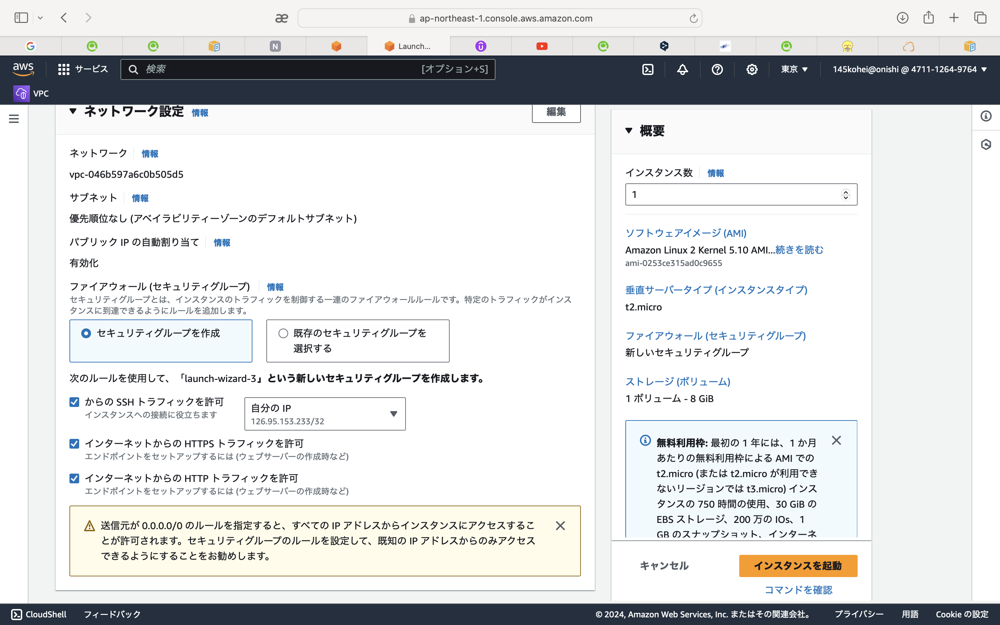

## 3. RDSの作成  
  - RDSのパスワードを設定。
  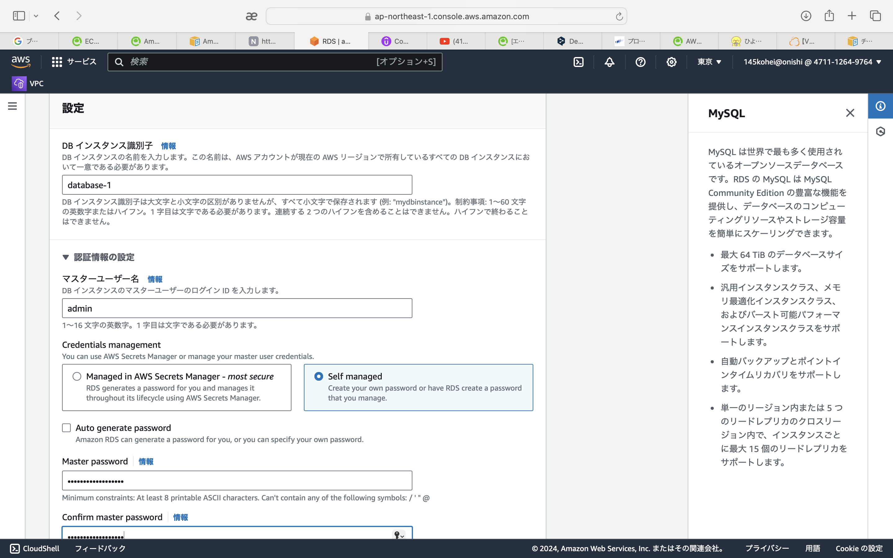  
  - ストレージの自動スケーリングを無効。
  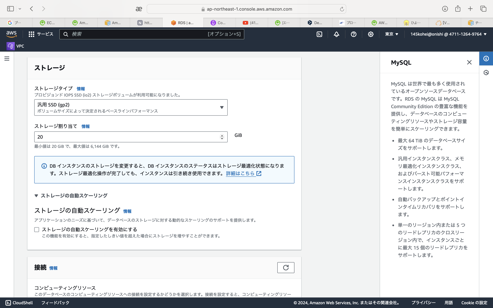
  - 作成したEC2インスタンスへ接続設定。
  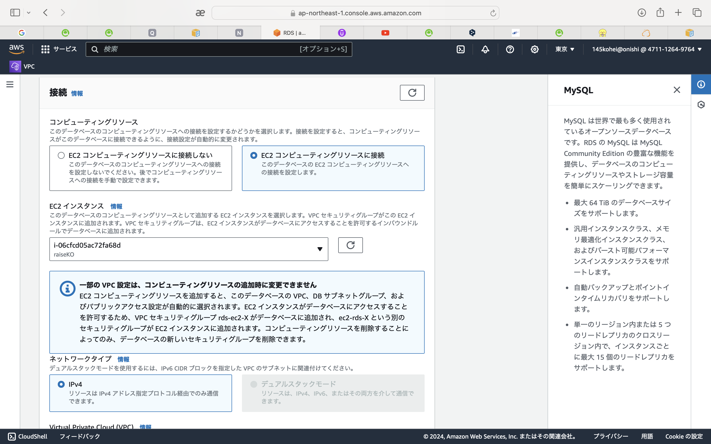  
  - サブネットグループ、セキュリティグループの新規作成。
  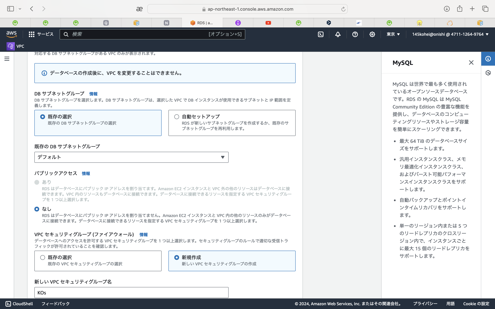

## 4. SSH接続でEC2に接続  
  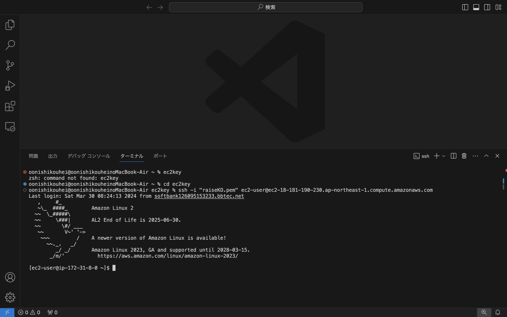  
  
## 5. EC2からRDSに接続  
  - MySQLをインストール後、MySQLへログイン。
  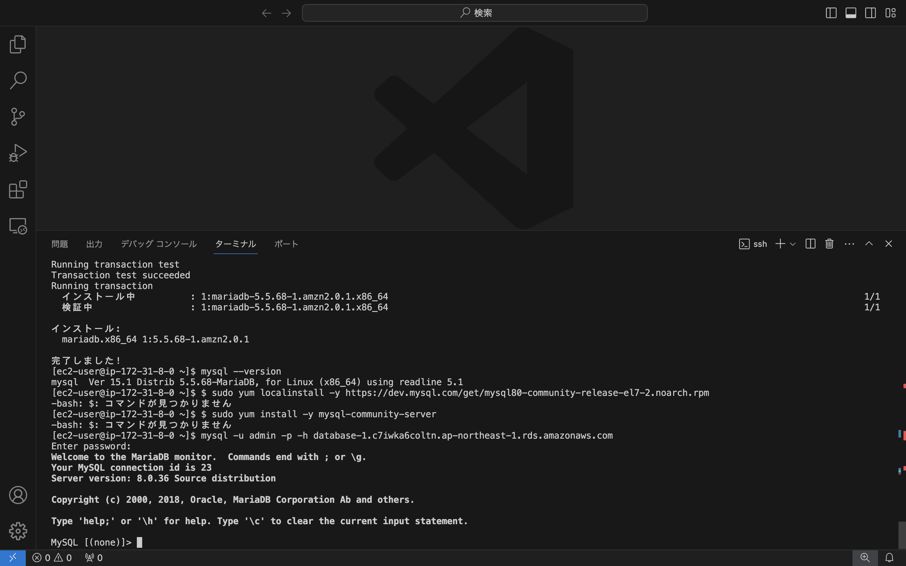

## 今回の課題から学んだこと感じたこと。  
今回の課題では環境構築をイメージするのにかなり時間がかかりました。  
CloudTechやUdemyの教材が分かりやすく、構築のイメージや各サービスの役割について理解できました。  
EC2作成時、OSをAmazonLinux2023で作成したため、MySQLのログインができなかったので、AmazonLinux2作り直してEC2からRDSに接続まで完了できました。  
RaiseTechの補助資料のAmazonLinuxのバージョンについては一読していましたが、EC2の作成時には忘れていたので間違えてAmazonLinux2023で作ってしまいました。  
作業に入る前には、しっかりと確認を行ってから取り掛かることが大事だということを学びました。
