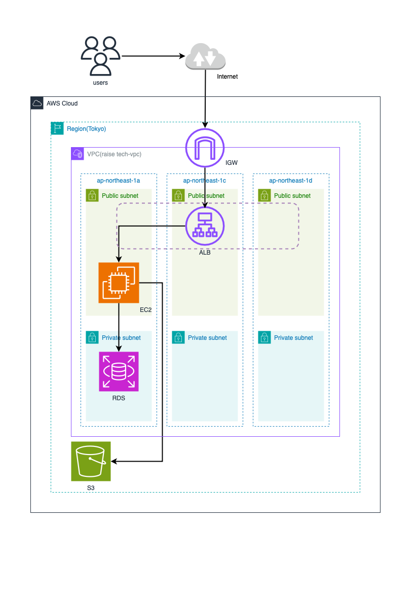

# 第5回課題

## 1. EC2内環境構築  
```
$ sudo yum -y update

$ sudo yum -y install \
git make gcc-c++ patch curl \
openssl-devel \
libcurl-devel libyaml-devel libffi-devel libicu-devel \
libxml2 libxslt libxml2-devel libxslt-devel \
zlib-devel readline-devel \
mysql mysql-server mysql-devel \
ImageMagick ImageMagick-devel \
epel-release
```

## 2. nodejsインストール  
```
# node.jsのパッケージをダウンロード
$ curl -sL https://rpm.nodesource.com/setup_14.x | sudo bash -

# node.jsをインストール
$ sudo yum install -y nodejs
```

## 3. yarnインストール
```
# yarnのパッケージをダウンロード
$ curl -sL https://dl.yarnpkg.com/rpm/yarn.repo | sudo tee /etc/yum.repos.d/yarn.repo

# yarnをインストール
$ sudo yum -y install yarn
```	

## 4. nvmインストール
```	
# nvmインストール
$ curl -o- https://raw.githubusercontent.com/nvm-sh/nvm/v0.39.1/install.sh | bash
$ source ~/.bashrc
$ nvm install v17.9.1
```	

## 5. rubyインストール
```	
# rbenvインストール
$ git clone https://github.com/sstephenson/rbenv.git ~/.rbenv
$ echo 'export PATH="$HOME/.rbenv/bin:$PATH"' >> ~/.bash_profile
$ echo 'eval "$(rbenv init -)"' >> ~/.bash_profile
$ source ~/.bash_profile

# ruby-buildインストールしてrubyをインストール
$ git clone https://github.com/sstephenson/ruby-build.git ~/.rbenv/plugins/ruby-build
$ rbenv install -v 3.2.3
$ rbenv global 3.2.3
$ rbenv rehash
$ ruby -v
```

## 6. database.yml設定 
```
# database.ymlをコピー
$ cp config/database.yml.sample config/database.yml
```

  

## 7. bundlerインストール
```	
$ gem install bundler -v2.3.14  
$ bundle install
```

## 8. setupした際webpackがインストールされていなかったためインストール   
```
# package.jsonを作成
$ npm init -y

# webpackとwebpack-cliをインストール
$ npm install -D webpack webpack-cli
```

## 9. setup
```	
$ bin/setup
```	


## 10. セキュリティグループのインバウンド設定でポート3000番を解放
  

## 11. 組み込みサーバー（puma）のみでの動作確認
```	
$ rails s  
```	

- curlでの動作確認
  

## 12. Unixソケット設定 
- Unixソケット設定  
 

- Unixソケットを接続して動作確認   
 

## 13. nginxインストール
```	
$ sudo amazon-linux-extras install nginx1

# nginx起動
$ sudo systemctl start nginx
```
nginx起動確認  
 

## 14. nginx設定
/etc/nginx/conf.d/default.conf設定  
 

/etc/nginx/nginx.conf設定  
   


## 15. セキュリティグループのインバウンド設定でポート80番を解放 
 

## 16. 組み込みサーバー、nginx、Unixソケットを組み合わせて動作確認


## 17. ALBの作成  
- ターゲットグループの作成  


- ALBの作成  


- ALBセキュリティグループ   
  - インバウンド
  
  - アウトバウンド
  

## 18. S3の作成  
- S3作成   


- S3バケットポリシーの設定  
   

- S3CORSの設定  


- 画像表示の設定のため、application.rb内のvipsをmini_magickへ変更  


- S3を追加してアプリケーションの動作確認  


## 19. AWS構成図の作成   


## 感想
環境構築を行うところから躓いて分からないことも多かったですが、色々と調べて試したりと試行錯誤しながら進めました。   
アプリケーションの動作でエラーが出た際に、エラーログに表示されたエラーについて調べるだけでなく、アプリケーションがどのようにして起動しているかなど、深くまで調べることの大切さを学びました。   
今回の課題ではあまり質問や周りに聞くことをしなかったので、無駄な作業も多くして時間がかかってしまったという印象でした。   
質問の際に自分の中でまとめきれずに質問できなかったのですが、今後は考えをまとめる力を身につけ質問していきたいと思います。
