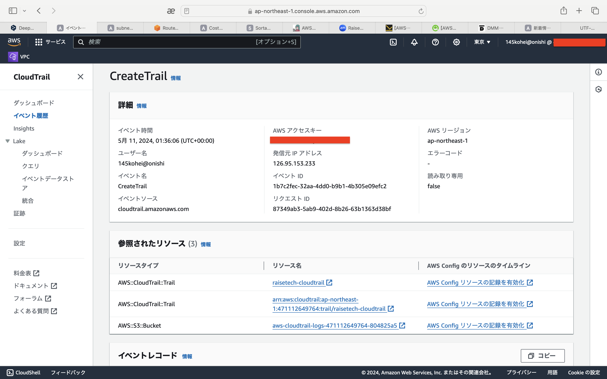
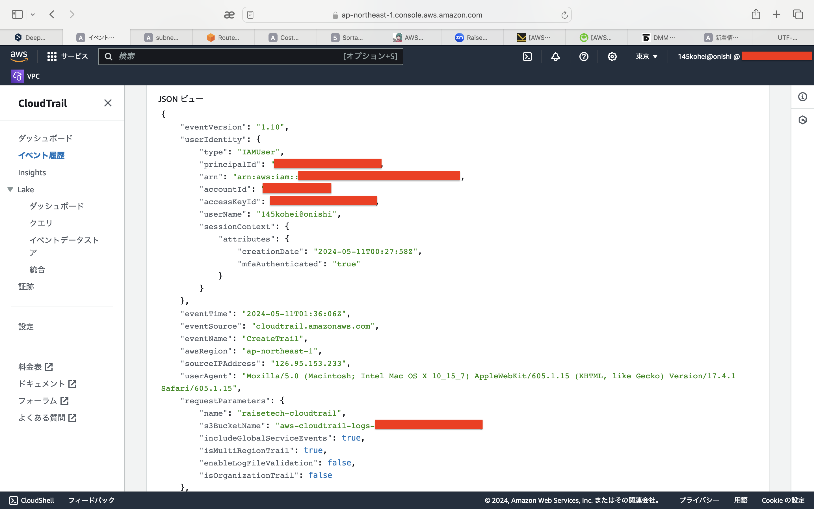
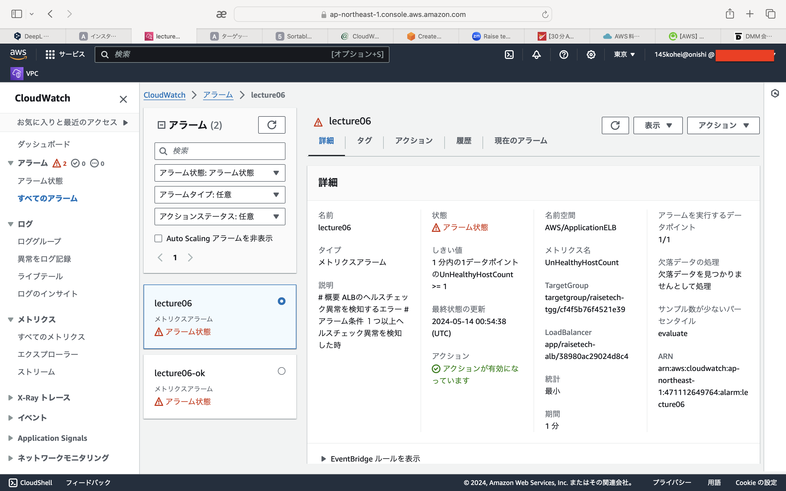
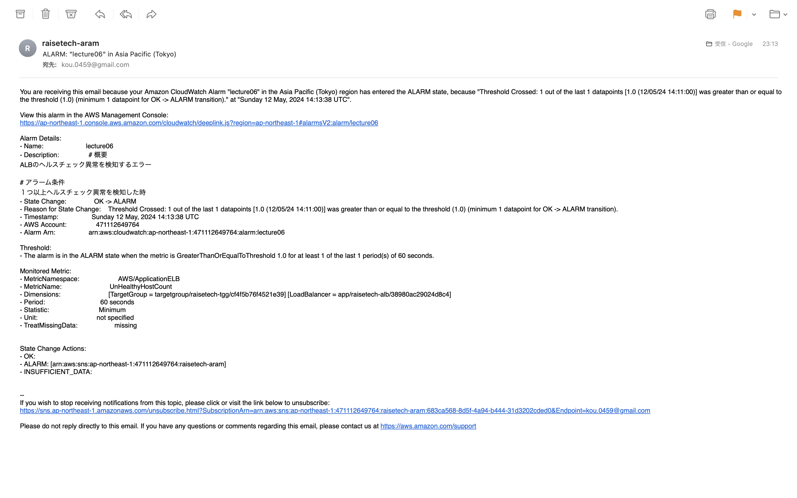
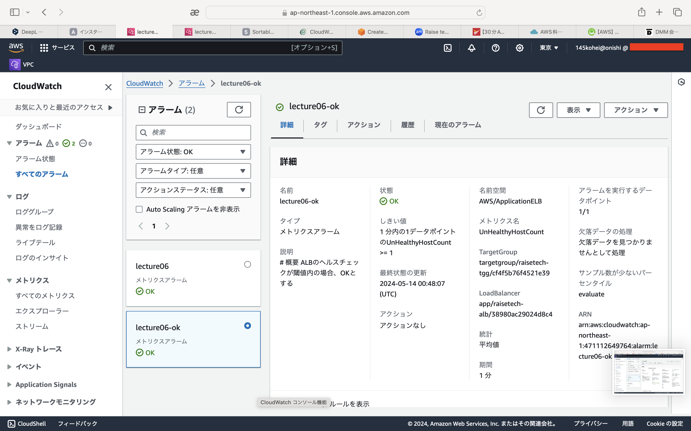
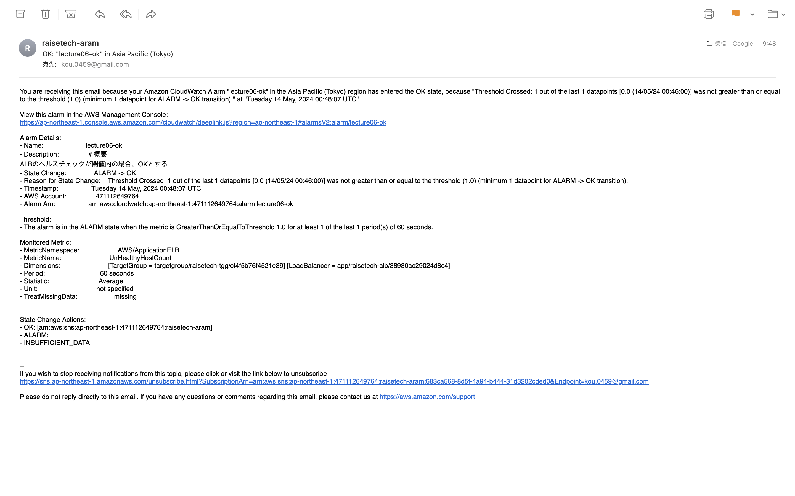
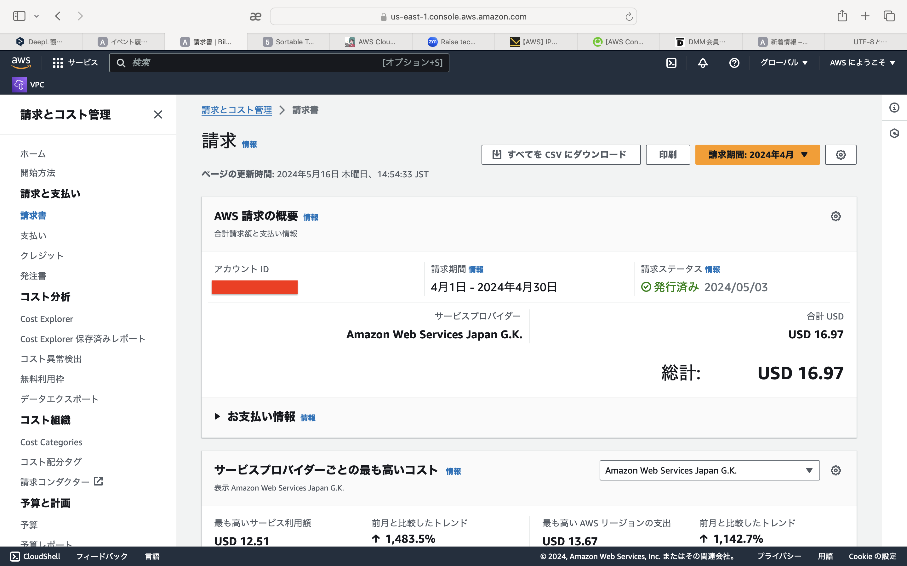
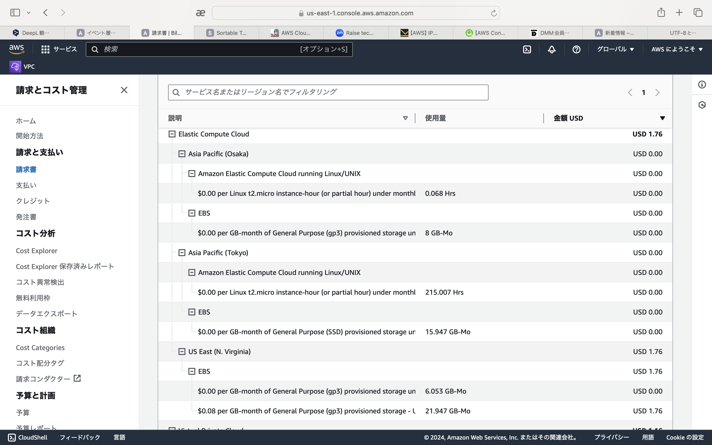
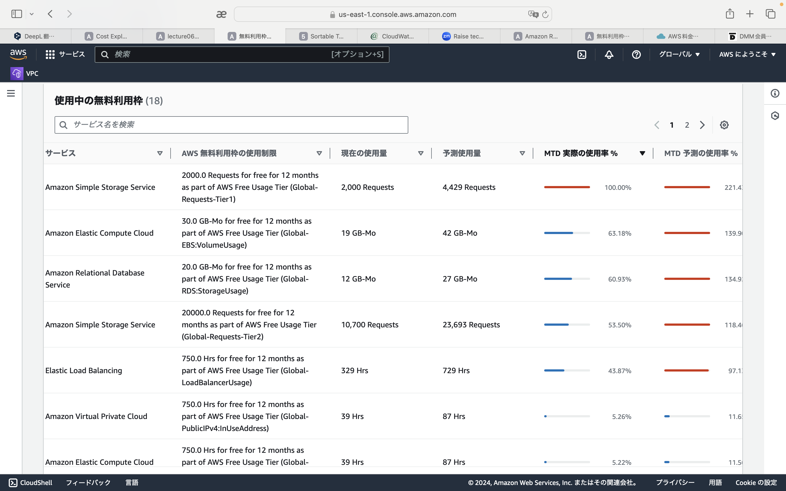

# 第6回課題   

## 1. CloudTrailでイベント名とその内容を３つピックアップする   
- "eventTime": "2024-05-11T01:36:06Z"
- "eventSource": "cloudtrail.amazonaws.com"
- "eventName": "CreateTrail"   

   
    

## 2. ALBアラーム設定、メールの通知ができるか   
- rails停止時   
   
 　　

- rails起動時   
    
   

## 3. AWSで今日までに作成したリソース内容の見積もり作成　　　　
https://calculator.aws/#/estimate?id=07d1f3cfb321973bdcf2965973176569306d29dd   

## 4. 先月のEC2の利用料が無料枠で収まっているか    
- EC2の利用料はCloud9で使用したバージニアのリージョンで料金が発生していました。  
その他のEC2は無料枠内に収まっていました。   
- EC2ではないですが、RDSを複数作成し都度停止していなかったため、無料枠を超えて利用料がかかってしまいました。   

   
   
   

## 感想   
今回の課題では、ログや利用料金に異常が発生した場合、すぐに察知できるようにしておく必要があるということを学びました。    
利用料の無料枠について、しっかりと把握せずに使用していたため、理解してコストがかからないようにすることの大切さを学びました。