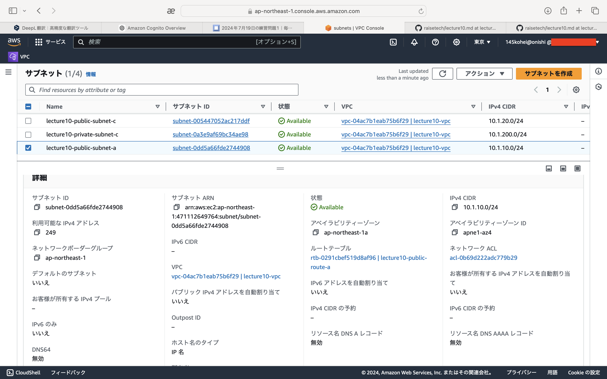
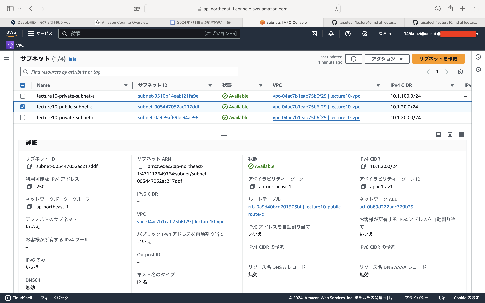
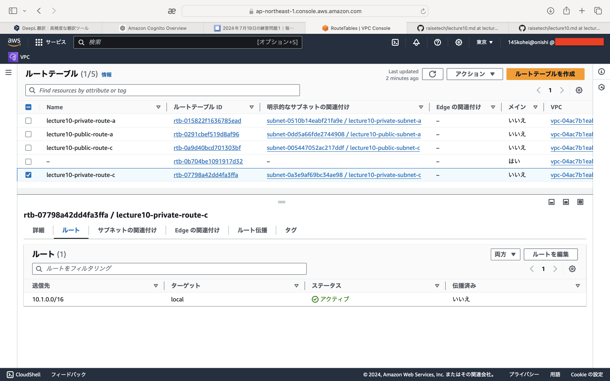
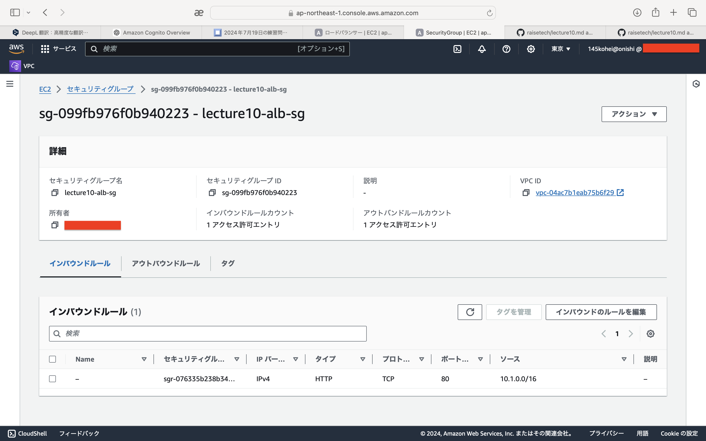
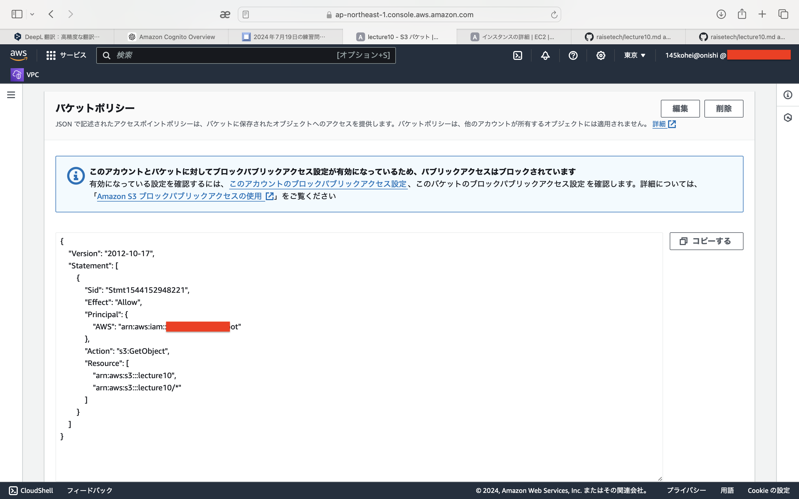
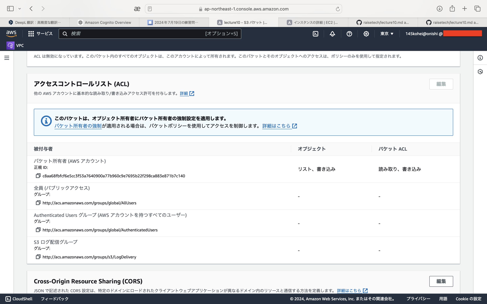

# 第10回課題

## 1. CloudFormationのテンプレート作成   
- VPC   
[vpc.yaml](template/vpc-temp.yml)
- EC2+ALB  
[ec2-alb.yaml](template/ec2-alb-temp.yml)
- RDS  
[rds.yaml](template/rds-temp.yml)
- S3  
[s3.yaml](template/s3-temp.yml)

## 2. VPC   
  
  

## 3. サブネット  
- パブリックサブネットa   
  
- パブリックサブネットc   
  
- プライベートサブネットa   
  
- プライベートサブネットc   
  

## 4. ルートテーブル  
- パブリックサブネットa   
  
- パブリックサブネットc   
  
- プライベートサブネットa   
  
- プライベートサブネットc   
   

## 5. ElasticIP
  

## 6. セキュリティグループ　　　
- managed SG インバウンド   
  
- managed SG アウトバウンド   
  
- web SG インバウンド   
  
- web SG アウトバウンド   
  
- RDS SG インバウンド   
  
- RDS SG アウトバウンド   
  
- ALB SG インバウンド   
  
- ALB SG アウトバウンド   
  

## 7. EC2  
  
  
  
  

## 8. ALB
- ターゲットグループ
  
- ALB
  

## 9. RDS
  

## 10. S3
- S3   
  
  
- S3ポリシー   
  
  

## 11. インスタンス起動
  

## 感想   
CloudFormationのテンプレートの理解に時間がかかりました。   
必要な設定やパターンが決まっているので理解ができれば設定内容が一目で分かるので便利だと思いました。   
今回の課題で作成したテンプレートはコピペして作ったのでしっかり理解していこうと思います。
