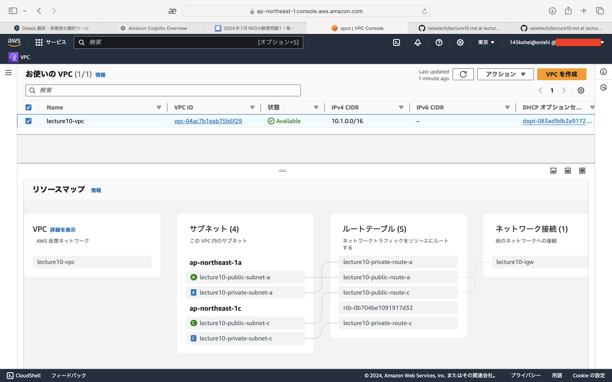
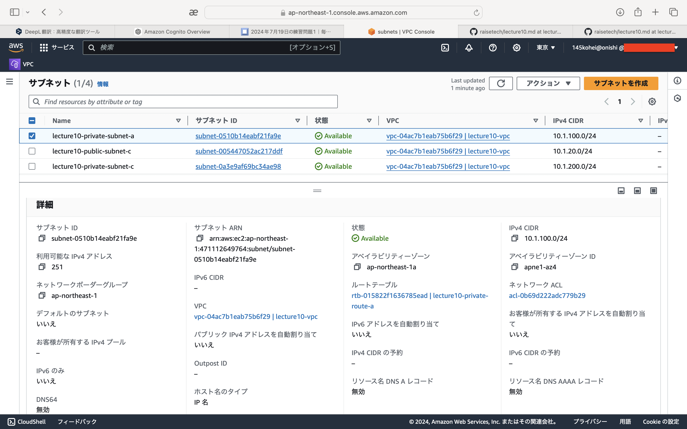
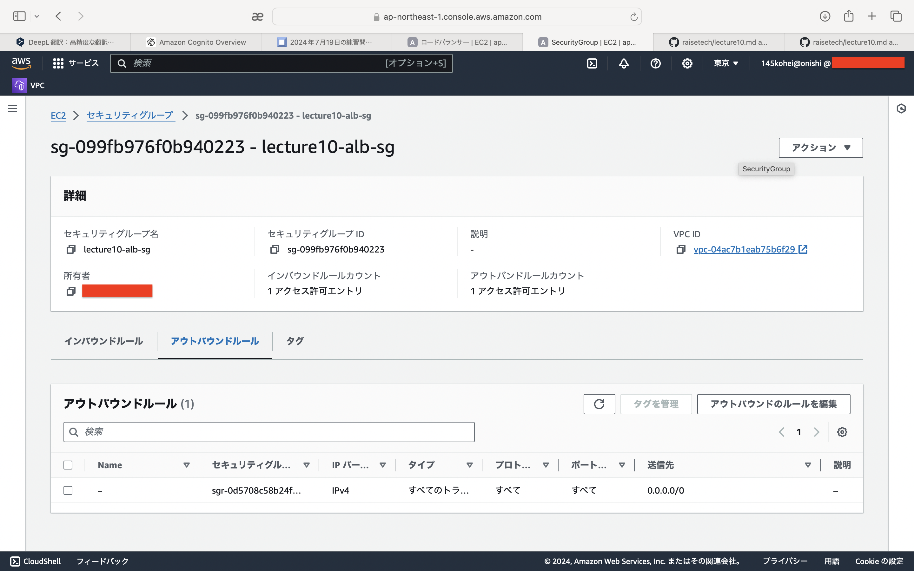
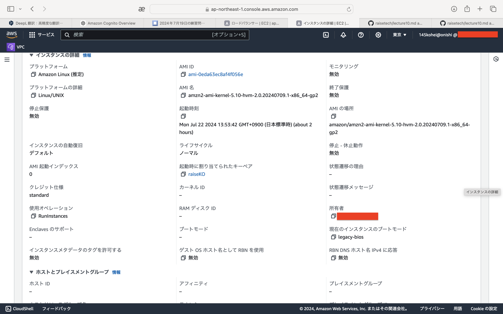

# 第10回課題

## 1. CloudFormationのテンプレート作成   
- VPC
```
AWSTemplateFormatVersion: "2010-09-09"
Description: 
  VPC and Subnet Create

Metadata: 
  "AWS::CloudFormation::Interface": 
    ParameterGroups: 
      - Label: 
          default: "lecture10"
        Parameters:
          - PJPrefix
      - Label: 
          default: "Network Configuration"
        Parameters: 
          - VPCCIDR
          - PublicSubnetACIDR
          - PublicSubnetCCIDR
          - PrivateSubnetACIDR
          - PrivateSubnetCCIDR
    ParameterLabels: 
      VPCCIDR: 
        default: "VPC CIDR"
      PublicSubnetACIDR: 
        default: "PublicSubnetA CIDR"
      PublicSubnetCCIDR: 
        default: "PublicSubnetC CIDR"
      PrivateSubnetACIDR: 
        default: "PrivateSubnetA CIDR"
      PrivateSubnetCCIDR: 
        default: "PrivateSubnetC CIDR"

# ------------------------------------------------------------#
# Input Parameters
# ------------------------------------------------------------# 
Parameters:
  PJPrefix:
    Type: String

  VPCCIDR:
    Type: String
    Default: "10.1.0.0/16"

  PublicSubnetACIDR:
    Type: String
    Default: "10.1.10.0/24"

  PublicSubnetCCIDR:
    Type: String
    Default: "10.1.20.0/24"

  PrivateSubnetACIDR:
    Type: String
    Default: "10.1.100.0/24"

  PrivateSubnetCCIDR:
    Type: String
    Default: "10.1.200.0/24"

Resources: 
# ------------------------------------------------------------#
#  VPC
# ------------------------------------------------------------#
# VPC Create
  VPC: 
    Type: "AWS::EC2::VPC"
    Properties: 
      CidrBlock: !Ref VPCCIDR
      EnableDnsSupport: "true"
      EnableDnsHostnames: "true"
      InstanceTenancy: default
      Tags: 
        - Key: Name
          Value: !Sub "${PJPrefix}-vpc"

# InternetGateway Create
  InternetGateway: 
    Type: "AWS::EC2::InternetGateway"
    Properties: 
      Tags: 
        - Key: Name
          Value: !Sub "${PJPrefix}-igw"

# IGW Attach
  InternetGatewayAttachment: 
    Type: "AWS::EC2::VPCGatewayAttachment"
    Properties: 
      InternetGatewayId: !Ref InternetGateway
      VpcId: !Ref VPC 

# ------------------------------------------------------------#
#  Subnet
# ------------------------------------------------------------#          
# Public SubnetA Create
  PublicSubnetA: 
    Type: "AWS::EC2::Subnet"
    Properties: 
      AvailabilityZone: "ap-northeast-1a"
      CidrBlock: !Ref PublicSubnetACIDR
      VpcId: !Ref VPC 
      Tags: 
        - Key: Name
          Value: !Sub "${PJPrefix}-public-subnet-a"

# Public SubnetC Create
  PublicSubnetC: 
    Type: "AWS::EC2::Subnet"
    Properties: 
      AvailabilityZone: "ap-northeast-1c"
      CidrBlock: !Ref PublicSubnetCCIDR
      VpcId: !Ref VPC 
      Tags: 
        - Key: Name
          Value: !Sub "${PJPrefix}-public-subnet-c"

# Private SubnetA Create
  PrivateSubnetA: 
    Type: "AWS::EC2::Subnet"
    Properties: 
      AvailabilityZone: "ap-northeast-1a"
      CidrBlock: !Ref PrivateSubnetACIDR
      VpcId: !Ref VPC 
      Tags: 
        - Key: Name
          Value: !Sub "${PJPrefix}-private-subnet-a"

# Private SubnetC Create
  PrivateSubnetC: 
    Type: "AWS::EC2::Subnet"
    Properties: 
      AvailabilityZone: "ap-northeast-1c"
      CidrBlock: !Ref PrivateSubnetCCIDR
      VpcId: !Ref VPC 
      Tags: 
        - Key: Name
          Value: !Sub "${PJPrefix}-private-subnet-c"

# ------------------------------------------------------------#
#  RouteTable
# ------------------------------------------------------------#          
# Public RouteTableA Create
  PublicRouteTableA: 
    Type: "AWS::EC2::RouteTable"
    Properties: 
      VpcId: !Ref VPC 
      Tags: 
        - Key: Name
          Value: !Sub "${PJPrefix}-public-route-a"

# Public RouteTableC Create
  PublicRouteTableC: 
    Type: "AWS::EC2::RouteTable"
    Properties: 
      VpcId: !Ref VPC 
      Tags: 
        - Key: Name
          Value: !Sub "${PJPrefix}-public-route-c"

# Private RouteTableA Create
  PrivateRouteTableA: 
    Type: "AWS::EC2::RouteTable"
    Properties: 
      VpcId: !Ref VPC 
      Tags: 
        - Key: Name
          Value: !Sub "${PJPrefix}-private-route-a"

# Private RouteTableC Create
  PrivateRouteTableC: 
    Type: "AWS::EC2::RouteTable"
    Properties: 
      VpcId: !Ref VPC 
      Tags: 
        - Key: Name
          Value: !Sub "${PJPrefix}-private-route-c"

# ------------------------------------------------------------#
# Routing
# ------------------------------------------------------------# 
# PublicRouteA Create
  PublicRouteA: 
    Type: "AWS::EC2::Route"
    Properties: 
      RouteTableId: !Ref PublicRouteTableA 
      DestinationCidrBlock: "0.0.0.0/0"
      GatewayId: !Ref InternetGateway 

# PublicRouteC Create
  PublicRouteC: 
    Type: "AWS::EC2::Route"
    Properties: 
      RouteTableId: !Ref PublicRouteTableC 
      DestinationCidrBlock: "0.0.0.0/0"
      GatewayId: !Ref InternetGateway 

# ------------------------------------------------------------#
# RouteTable Associate
# ------------------------------------------------------------# 
# PublicRouteTable Associate SubnetA
  PublicSubnetARouteTableAssociation: 
    Type: "AWS::EC2::SubnetRouteTableAssociation"
    Properties: 
      SubnetId: !Ref PublicSubnetA 
      RouteTableId: !Ref PublicRouteTableA

# PublicRouteTable Associate SubnetC
  PublicSubnetCRouteTableAssociation: 
    Type: "AWS::EC2::SubnetRouteTableAssociation"
    Properties: 
      SubnetId: !Ref PublicSubnetC 
      RouteTableId: !Ref PublicRouteTableC

# PrivateRouteTable Associate SubnetA
  PrivateSubnetARouteTableAssociation: 
    Type: "AWS::EC2::SubnetRouteTableAssociation"
    Properties: 
      SubnetId: !Ref PrivateSubnetA
      RouteTableId: !Ref PrivateRouteTableA 

# PrivateRouteTable Associate SubnetC
  PrivateSubnetCRouteTableAssociation: 
    Type: "AWS::EC2::SubnetRouteTableAssociation"
    Properties: 
      SubnetId: !Ref PrivateSubnetC
      RouteTableId: !Ref PrivateRouteTableC

# ------------------------------------------------------------#
# Output Parameters
# ------------------------------------------------------------#                
Outputs:
# VPC
  VPC:
    Value: !Ref VPC
    Export:
      Name: !Sub "${PJPrefix}-vpc"

  VPCCIDR:
    Value: !Ref VPCCIDR
    Export:
      Name: !Sub "${PJPrefix}-vpc-cidr"

# Subnet
  PublicSubnetA:
    Value: !Ref PublicSubnetA
    Export:
      Name: !Sub "${PJPrefix}-public-subnet-a"

  PublicSubnetACIDR:
    Value: !Ref PublicSubnetACIDR
    Export:
      Name: !Sub "${PJPrefix}-public-subnet-a-cidr"

  PublicSubnetC:
    Value: !Ref PublicSubnetC
    Export:
      Name: !Sub "${PJPrefix}-public-subnet-c"

  PublicSubnetCCIDR:
    Value: !Ref PublicSubnetCCIDR
    Export:
      Name: !Sub "${PJPrefix}-public-subnet-c-cidr"

  PrivateSubnetA:
    Value: !Ref PrivateSubnetA
    Export:
      Name: !Sub "${PJPrefix}-private-subnet-a"

  PrivateSubnetACIDR:
    Value: !Ref PrivateSubnetACIDR
    Export:
      Name: !Sub "${PJPrefix}-private-subnet-a-cidr"

  PrivateSubnetC:
    Value: !Ref PrivateSubnetC
    Export:
      Name: !Sub "${PJPrefix}-private-subnet-c"

  PrivateSubnetCCIDR:
    Value: !Ref PrivateSubnetCCIDR
    Export:
      Name: !Sub "${PJPrefix}-private-subnet-c-cidr"

# Route
  PublicRouteTableA:
    Value: !Ref PublicRouteTableA
    Export:
      Name: !Sub "${PJPrefix}-public-route-a"

  PublicRouteTableC:
    Value: !Ref PublicRouteTableC
    Export:
      Name: !Sub "${PJPrefix}-public-route-c"

  PrivateRouteTableA:
    Value: !Ref PrivateRouteTableA
    Export:
      Name: !Sub "${PJPrefix}-private-route-a"

  PrivateRouteTableC:
    Value: !Ref PrivateRouteTableC
    Export:
      Name: !Sub "${PJPrefix}-private-route-c"
```

- EC2+ALB
```
AWSTemplateFormatVersion: "2010-09-09"
Description:
  ALB and EC2 Instance Create

Metadata:
  "AWS::CloudFormation::Interface":
    ParameterGroups:
      - Label:
          default: "lecture10"
        Parameters:
          - PJPrefix
      - Label:
          default: "InternetALB Configuration"
        Parameters:
          - InternetALBName
      - Label:
          default: "EC2Instance Configuration"
        Parameters:
          - KeyPairName
          - EC2InstanceName
          - EC2InstanceAMI
          - EC2InstanceInstanceType
          - EC2InstanceVolumeType
          - EC2InstanceVolumeSize
          - SSHAccessSourceIP

    ParameterLabels:
      InternetALBName:
        default: "InternetALBName"
      KeyPairName:
        default: "KeyPairName"
      EC2InstanceName:
        default: "EC2 Name"
      EC2InstanceAMI:
        default: "EC2 AMI"
      EC2InstanceInstanceType:
        default: "EC2 InstanceType"
      EC2InstanceVolumeType:
        default: "EC2 VolumeType"
      EC2InstanceVolumeSize:
        default: "EC2 VolumeSize"
      SSHAccessSourceIP:
        default: "SSH AccessSourceIP"

# ------------------------------------------------------------#
# Input Parameters
# ------------------------------------------------------------# 
Parameters:
  PJPrefix:
    Type: String

#InternetALB
  InternetALBName:
    Type: String
    Default: "web"

#EC2Instance
  KeyPairName:
    Type: AWS::EC2::KeyPair::KeyName
    Default: ""
  EC2InstanceName:
    Type: String
    Default: "EC2"
  EC2InstanceAMI:
    Type: AWS::SSM::Parameter::Value<AWS::EC2::Image::Id>
    Default: /aws/service/ami-amazon-linux-latest/amzn2-ami-kernel-5.10-hvm-x86_64-gp2
  EC2InstanceInstanceType:
    Type: String
    Default: "t2.micro"
  EC2InstanceVolumeType:
    Type: String
    Default: "gp2"
  EC2InstanceVolumeSize:
    Type: String
    Default: "30"
  SSHAccessSourceIP:
    Type: String

Resources:
# ------------------------------------------------------------#
#  IAM Role for EC2
# ------------------------------------------------------------# 
  EC2IAMRole: 
    Type: "AWS::IAM::Role"
    Properties: 
      RoleName: !Sub "${PJPrefix}-${EC2InstanceName}-role" 
      AssumeRolePolicyDocument: 
        Version: "2012-10-17"
        Statement: 
          - Effect: Allow
            Principal: 
              Service: 
                - "ec2.amazonaws.com"
            Action: 
              - "sts:AssumeRole"
      Path: "/"
      ManagedPolicyArns: 
        - "arn:aws:iam::aws:policy/service-role/AmazonEC2RoleforSSM"
        - "arn:aws:iam::aws:policy/AmazonEC2ReadOnlyAccess"

  EC2InstanceProfile: 
    Type: "AWS::IAM::InstanceProfile"
    Properties: 
      Path: "/"
      Roles: 
        - Ref: EC2IAMRole
      InstanceProfileName: !Sub "${PJPrefix}-${EC2InstanceName}-profile"

# ------------------------------------------------------------#
#  EC2Instance AZ:A
# ------------------------------------------------------------#
  EC2Instance:
    Type: "AWS::EC2::Instance"
    Properties:
      Tags:
        - Key: Name
          Value: !Sub "${PJPrefix}-${EC2InstanceName}-01"
      ImageId: !Ref EC2InstanceAMI
      InstanceType: !Ref EC2InstanceInstanceType
      KeyName: !Ref KeyPairName
      IamInstanceProfile: !Ref EC2InstanceProfile
      DisableApiTermination: false
      EbsOptimized: false
      BlockDeviceMappings:
        - DeviceName: /dev/xvda
          Ebs:
            DeleteOnTermination: true
            VolumeType: !Ref EC2InstanceVolumeType
            VolumeSize: !Ref EC2InstanceVolumeSize
      SecurityGroupIds:
        - !Ref ManagedSecurityGroup
        - !Ref WebSecurityGroup
      SubnetId: { "Fn::ImportValue": !Sub "${PJPrefix}-public-subnet-a" }
      UserData: !Base64 | 
        #! /bin/bash
        sudo yum update -y
        sudo yum -y install httpd
        sudo systemctl start httpd.service
        sudo systemctl enable httpd.service

# ------------------------------------------------------------#
#  SecurityGroup for Managed
# ------------------------------------------------------------#
  ManagedSecurityGroup:
    Type: "AWS::EC2::SecurityGroup"
    Properties: 
      VpcId: { "Fn::ImportValue": !Sub "${PJPrefix}-vpc" }
      GroupName: !Sub "${PJPrefix}-managed-sg"
      GroupDescription: "-"
      Tags:
        - Key: "Name"
          Value: !Sub "${PJPrefix}-managed-sg"
# Rule
      SecurityGroupIngress:
        - IpProtocol: tcp
          FromPort: 22
          ToPort: 22
          CidrIp: !Ref SSHAccessSourceIP

# ------------------------------------------------------------#
#  SecurityGroup for ALB
# ------------------------------------------------------------#
  ALBSecurityGroup:
    Type: "AWS::EC2::SecurityGroup"
    Properties:
      VpcId: { "Fn::ImportValue": !Sub "${PJPrefix}-vpc" }
      GroupName: !Sub "${PJPrefix}-alb-sg"
      GroupDescription: "-"
      Tags:
        - Key: "Name"
          Value: !Sub "${PJPrefix}-alb-sg"
# Rule
      SecurityGroupIngress:
        - IpProtocol: tcp
          FromPort: 80
          ToPort: 80
          CidrIp: "0.0.0.0/0"

# ------------------------------------------------------------#
#  SecurityGroup for Web
# ------------------------------------------------------------#
  WebSecurityGroup:
    Type: "AWS::EC2::SecurityGroup"
    Properties:
      VpcId: { "Fn::ImportValue": !Sub "${PJPrefix}-vpc" }
      GroupName: !Sub "${PJPrefix}-web-sg"
      GroupDescription: "-"
      Tags:
        - Key: "Name"
          Value: !Sub "${PJPrefix}-web-sg"

# Rule
  WebSecurityGroupIngress: 
    Type: "AWS::EC2::SecurityGroupIngress"
    Properties: 
      IpProtocol: tcp
      FromPort: 80
      ToPort: 80
      SourceSecurityGroupId: !GetAtt [ ALBSecurityGroup, GroupId ] 
      GroupId: !GetAtt [ WebSecurityGroup, GroupId ]

# ------------------------------------------------------------#
#  ElasticIP
# ------------------------------------------------------------# 
  ElasticIP:
    Type: "AWS::EC2::EIP"
    Properties:
      Domain: vpc

  ElasticIPAssociate:
    Type: AWS::EC2::EIPAssociation
    Properties: 
      AllocationId: !GetAtt ElasticIP.AllocationId
      InstanceId: !Ref EC2Instance

# ------------------------------------------------------------#
#  Target Group
# ------------------------------------------------------------#
  TargetGroup: 
    Type: "AWS::ElasticLoadBalancingV2::TargetGroup"
    Properties: 
      VpcId: { "Fn::ImportValue": !Sub "${PJPrefix}-vpc" } 
      Name: !Sub "${PJPrefix}-${InternetALBName}-tg"
      Protocol: HTTP
      Port: 80
      HealthCheckProtocol: HTTP
      HealthCheckPath: "/"
      HealthCheckPort: "traffic-port"
      HealthyThresholdCount: 2
      UnhealthyThresholdCount: 2
      HealthCheckTimeoutSeconds: 5
      HealthCheckIntervalSeconds: 10
      Matcher: 
        HttpCode: 200
      Tags: 
        - Key: Name
          Value: !Sub "${PJPrefix}-${InternetALBName}-tg"
      TargetGroupAttributes: 
        - Key: "deregistration_delay.timeout_seconds"
          Value: 300
        - Key: "stickiness.enabled"
          Value: false
        - Key: "stickiness.type"
          Value: lb_cookie
        - Key: "stickiness.lb_cookie.duration_seconds"
          Value: 86400
      Targets: 
        - Id: !Ref EC2Instance
          Port: 80

# ------------------------------------------------------------#
#  Internet ALB
# ------------------------------------------------------------#
  InternetALB: 
    Type: "AWS::ElasticLoadBalancingV2::LoadBalancer"
    Properties: 
      Name: !Sub "${PJPrefix}-${InternetALBName}-alb"
      Tags: 
        - Key: Name
          Value: !Sub "${PJPrefix}-${InternetALBName}-alb"
      Scheme: "internet-facing"
      LoadBalancerAttributes: 
        - Key: "deletion_protection.enabled"
          Value: false
        - Key: "idle_timeout.timeout_seconds"
          Value: 60
      SecurityGroups:
        - !Ref ALBSecurityGroup
      Subnets: 
        - { "Fn::ImportValue": !Sub "${PJPrefix}-public-subnet-a" }
        - { "Fn::ImportValue": !Sub "${PJPrefix}-public-subnet-c" }

  ALBListener: 
    Type: "AWS::ElasticLoadBalancingV2::Listener"
    Properties: 
      DefaultActions: 
        - TargetGroupArn: !Ref TargetGroup
          Type: forward
      LoadBalancerArn: !Ref InternetALB
      Port: 80
      Protocol: HTTP

# ------------------------------------------------------------#
# Output Parameters
# ------------------------------------------------------------#                
Outputs:
#InternetALB
  ALBDNSName:
    Value: !GetAtt InternetALB.DNSName
    Export:
      Name: !Sub "${PJPrefix}-${InternetALBName}-alb-dnsname"
     
#EC2Instance
  EC2InstanceID:
    Value: !Ref EC2Instance
    Export:
      Name: !Sub "${PJPrefix}-${EC2InstanceName}-id"
  EC2InstancePrivateIp:
    Value: !GetAtt EC2Instance.PrivateIp
    Export:
      Name: !Sub "${PJPrefix}-${EC2InstanceName}-private-ip"
  EC2InstanceEIP:
    Value: !GetAtt EC2Instance.PublicIp
    Export:
      Name: !Sub "${PJPrefix}-${EC2InstanceName}-eip"
  EC2InstanceRoleName:
    Value: !Sub "${PJPrefix}-${EC2InstanceName}-role"
    Export:
      Name: !Sub "${PJPrefix}-${EC2InstanceName}-role-name"
```

- RDS
```
AWSTemplateFormatVersion: "2010-09-09"
Description:
  RDS for  MySQL Create

Metadata:
  "AWS::CloudFormation::Interface":
    ParameterGroups:
      - Label:
          default: "lecture10"
        Parameters:
          - PJPrefix
      - Label:
          default: "RDS Configuration"
        Parameters:
          - DBInstanceName
          - MySQLMajorVersion
          - MySQLMinorVersion
          - DBInstanceClass
          - DBInstanceStorageSize
          - DBInstanceStorageType
          - DBName
          - DBMasterUserName
          - DBPassword
          - MultiAZ
    ParameterLabels:
      DBInstanceName:
        default: "DBInstanceName"
      MySQLMajorVersion:
        default: "MySQLMajorVersion"
      MySQLMinorVersion:
        default: "MySQLMinorVersion"
      DBInstanceClass:
        default: "DBInstanceClass"
      DBInstanceStorageSize:
        default: "DBInstanceStorageSize"
      DBInstanceStorageType:
        default: "DBInstanceStorageType"
      DBName:
        default: "DBName"
      DBMasterUserName:
        default: "DBUserName"
      DBPassword:
        default: "DBPassword"
      MultiAZ:
        default: "MultiAZ"

# ------------------------------------------------------------#
# Input Parameters
# ------------------------------------------------------------# 
Parameters:
  PJPrefix:
    Type: String

  DBInstanceName:
    Type: String
    Default: "rds"
  MySQLMajorVersion:
    Type: String
    Default: "8.0"
  MySQLMinorVersion:
    Type: String
    Default: "36"
  DBInstanceClass:
    Type: String
    Default: "db.t3.micro" 
  DBInstanceStorageSize:
    Type: String
    Default: "20"
  DBInstanceStorageType:
    Type: String
    Default: "gp2"
  DBName:
    Type: String
    Default: "db"
  DBMasterUserName:
    Type: String
    Default: "admin"
    NoEcho: true
    MinLength: 1
    MaxLength: 16
    AllowedPattern: "[a-zA-Z][a-zA-Z0-9]*"
    ConstraintDescription: "must begin with a letter and contain only alphanumeric characters."
  DBPassword: 
    Default: "dbpassword"
    NoEcho: true
    Type: String
    MinLength: 8
    MaxLength: 41
    AllowedPattern: "[a-zA-Z0-9]*"
    ConstraintDescription: "must contain only alphanumeric characters."
  MultiAZ: 
    Default: "false"
    Type: String
    AllowedValues: [ "true", "false" ]

Resources: 
# ------------------------------------------------------------#
#  DBInstance MySQL
# ------------------------------------------------------------#
  DBInstance: 
    Type: "AWS::RDS::DBInstance"
    Properties: 
      DBInstanceIdentifier: !Sub "${PJPrefix}-${DBInstanceName}"
      Engine: MySQL
      EngineVersion: !Sub "${MySQLMajorVersion}.${MySQLMinorVersion}"
      DBInstanceClass: !Ref DBInstanceClass
      AllocatedStorage: !Ref DBInstanceStorageSize
      StorageType: !Ref DBInstanceStorageType
      DBName: !Ref DBName
      MasterUsername: !Ref DBMasterUserName
      MasterUserPassword: !Ref DBPassword
      DBSubnetGroupName: !Ref DBSubnetGroup
      PubliclyAccessible: false
      MultiAZ: !Ref MultiAZ
      PreferredBackupWindow: "18:00-18:30"
      PreferredMaintenanceWindow: "sat:19:00-sat:19:30"
      AutoMinorVersionUpgrade: false
      DBParameterGroupName: !Ref DBParameterGroup  
      VPCSecurityGroups:
        - !Ref RDSSecurityGroup
      CopyTagsToSnapshot: true
      BackupRetentionPeriod: 7
      Tags: 
        - Key: "Name"
          Value: !Ref DBInstanceName
    DeletionPolicy: "Delete"

# ------------------------------------------------------------#
#  DBParameterGroup
# ------------------------------------------------------------#
  DBParameterGroup:
    Type: "AWS::RDS::DBParameterGroup"
    Properties:
      Family: !Sub "MySQL${MySQLMajorVersion}"
      Description: !Sub "${PJPrefix}-${DBInstanceName}-parm"

# ------------------------------------------------------------#
#  SecurityGroup for RDS (MySQL)
# ------------------------------------------------------------#
  RDSSecurityGroup:
    Type: "AWS::EC2::SecurityGroup"
    Properties:
      VpcId: { "Fn::ImportValue": !Sub "${PJPrefix}-vpc" }
      GroupName: !Sub "${PJPrefix}-${DBInstanceName}-sg"
      GroupDescription: "-"
      Tags:
        - Key: "Name"
          Value: !Sub "${PJPrefix}-${DBInstanceName}-sg"
# Rule
      SecurityGroupIngress:
        - IpProtocol: tcp
          FromPort: 3306
          ToPort: 3306
          CidrIp: { "Fn::ImportValue": !Sub "${PJPrefix}-vpc-cidr" }

# ------------------------------------------------------------#
#  DBSubnetGroup
# ------------------------------------------------------------#
  DBSubnetGroup: 
    Type: "AWS::RDS::DBSubnetGroup"
    Properties: 
      DBSubnetGroupName: !Sub "${PJPrefix}-${DBInstanceName}-subnet"
      DBSubnetGroupDescription: "-"
      SubnetIds: 
        - { "Fn::ImportValue": !Sub "${PJPrefix}-private-subnet-a" }
        - { "Fn::ImportValue": !Sub "${PJPrefix}-private-subnet-c" }

# ------------------------------------------------------------#
# Output Parameters
# ------------------------------------------------------------#                
Outputs:
#DBInstance
  DBInstanceID:
    Value: !Ref DBInstance
    Export:
      Name: !Sub "${PJPrefix}-${DBInstanceName}-id"

  DBInstanceEndpoint:
    Value: !GetAtt DBInstance.Endpoint.Address
    Export:
      Name: !Sub "${PJPrefix}-${DBInstanceName}-endpoint"

  DBName:
    Value: !Ref DBName
    Export:
      Name: !Sub "${PJPrefix}-${DBInstanceName}-dbname"

```

- S3
```
AWSTemplateFormatVersion: 2010-09-09
Description: Access Restricted S3 Bucket

Parameters:
  S3BucketName:
    Description: Type of this BacketName.
    Type: String

Resources:
  SampleBucket:
    Type: 'AWS::S3::Bucket'
    Properties:
      BucketName: !Sub ${S3BucketName}
      PublicAccessBlockConfiguration:
        BlockPublicAcls: true
        BlockPublicPolicy: true
        IgnorePublicAcls: true
        RestrictPublicBuckets: true
      BucketEncryption:
        ServerSideEncryptionConfiguration:
          - ServerSideEncryptionByDefault:
              SSEAlgorithm: AES256

  SampleBucketPolicy:
    Type: 'AWS::S3::BucketPolicy'
    Properties:
      Bucket: !Ref SampleBucket
      PolicyDocument:
        Version: 2012-10-17
        Statement:
          - Action:
            - 's3:GetObject'
            Effect: "Allow"
            Sid: Stmt1544152948221
            Resource: 
              - !Sub 'arn:aws:s3:::${SampleBucket}'
              - !Sub 'arn:aws:s3:::${SampleBucket}/*'
            Principal:
              AWS: !Sub 'arn:aws:iam::${AWS::AccountId}:root'

Outputs:
  SampleBucket:
    Value: !Ref SampleBucket
```


## 2. VPC   
  
  


## 3. サブネット  
- パブリックサブネットa   
  
- パブリックサブネットc   
  
- プライベートサブネットa   
  
- プライベートサブネットc   
  


## 4. ルートテーブル  
- パブリックサブネットa   
  
- パブリックサブネットc   
  
- プライベートサブネットa   
  
- プライベートサブネットc   
   


## 5. ElasticIP
  


## 6. セキュリティグループ　　　
- managed SG インバウンド   
  
- managed SG アウトバウンド   
  
- web SG インバウンド   
  
- web SG アウトバウンド   
  
- RDS SG インバウンド   
  
- RDS SG アウトバウンド   
  
- ALB SG インバウンド   
  
- ALB SG アウトバウンド   
  


## 7. EC2  
  
  
  
  


## 8. ALB
- ターゲットグループ
  
- ALB
  


## 9. RDS
  


## 10. S3
- S3   
  
  
- S3ポリシー   
  
  


## 11. インスタンス起動
  


## 感想   
CloudFormationのテンプレートの理解に時間がかかりました。   
必要な設定やパターンが決まっているので理解ができれば設定内容が一目で分かるので便利だと思いました。   
今回の課題で作成したテンプレートはコピペして作ったのでしっかり理解していこうと思います。
