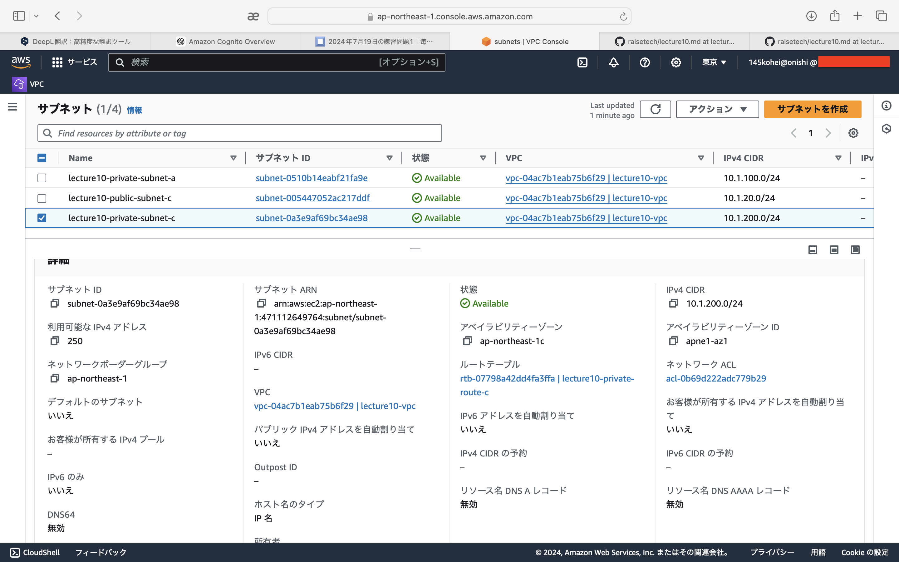
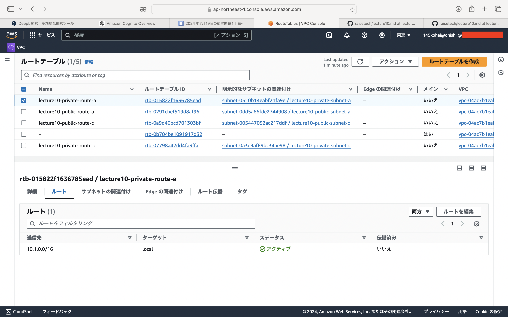
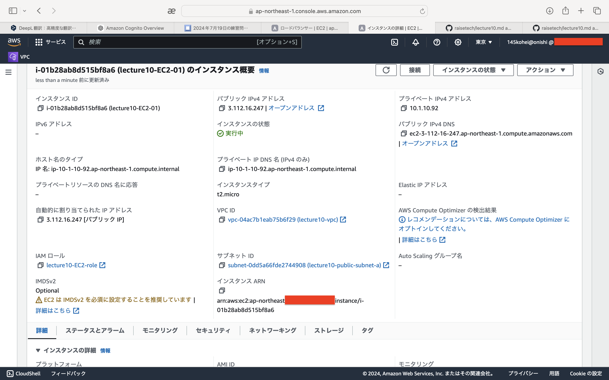
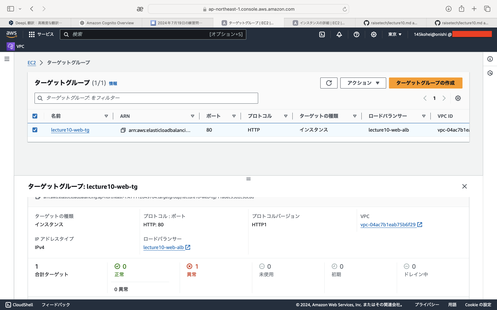
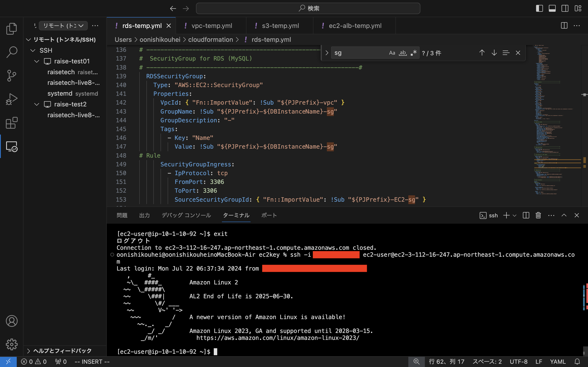

# 第10回課題

## 1. CloudFormationのテンプレート作成   
- VPC   
[vpc.yaml](cloudformation/lecture10.temp/vpc-temp.yml)
- EC2+ALB  
[ec2-alb.yaml](cloudformation/lecture10.temp/ec2-alb-temp.yml)
- RDS  
[rds.yaml](cloudformation/lecture10.temp/rds-temp.yml)
- S3  
[s3.yaml](cloudformation/lecture10.temp/s3-temp.yml)

## 2. VPC   
  
  

## 3. サブネット  
- パブリックサブネットa   
  
- パブリックサブネットc   
  
- プライベートサブネットa   
  
- プライベートサブネットc   
  

## 4. ルートテーブル  
- パブリックルートa   
  
- パブリックルートc   
  
- プライベートルートa   
  
- プライベートルートc   
   

## 5. セキュリティグループ　　　
- EC2 SG   
  
- RDS SG   
   
- ALB SG インバウンド   
  
- ALB SG アウトバウンド   
  

## 6. EC2  
  
  
  

## 7. ALB
- ターゲットグループ
  
- ALB
  

## 8. RDS
  

## 9. S3
- S3   
  

  
- S3ポリシー   
  
  

## 10. インスタンス起動
  

## 11. RDS接続＋MySQLバージョン
  

## 感想   
CloudFormationのテンプレートの理解に時間がかかりました。   
必要な設定やパターンが決まっているので理解ができれば設定内容が一目で分かるので便利だと思いました。   
今回の課題で作成したテンプレートはコピペして作ったのでしっかり理解していこうと思います。
