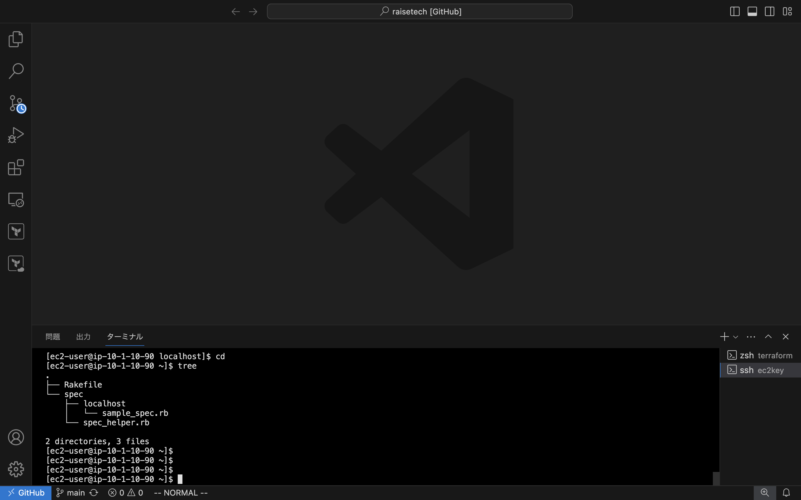
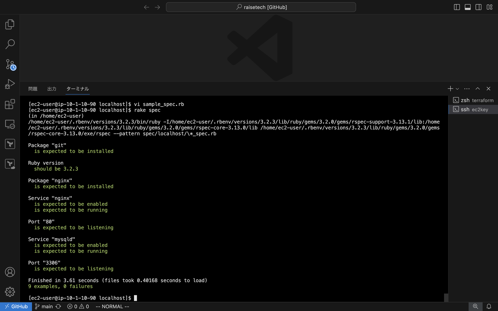

# 第11回課題

## 1. SERVERSPECでテストコードを記述。
- [テストコードリンク](severspec/sample_spec.rb)

| No | テスト項目 |
| :---: | :--- |
| 1 | gitがインストールされているか |
| 2 | ruby 3.2.3がインストールされているか |
| 3 | Nginxがインストールされているか |
| 4 | Nginxが自動起動設定になっているか |
| 5 | Nginxが実行中であるか |
| 6 | ポート80がリスニング状態にあるかどうか |
| 7 | MySQLが自動起動設定になっているか |
| 8 | MySQLが実行中であるか |
| 9 | ポート3306でListenしているか |

## 2. エビデンス画像
- 作成したSERVERSPECのディレクトリツリー  
  

- テストコード実行後の結果  
  

## 3. 感想
テストコードを作成することで、コマンドを一回ずつ手動で確認しなくても、結果をすぐに把握できるだけでなく、確認漏れを防ぐことができるため、非常に重要なアプリケーションだと感じました。  
また、テストコードは確認項目を簡単に追加したり、削除したりできるので、使い勝手が良いとも感じました。  
コードの記述にはいくつかの違いがあったので、理解を深めるためにさらに調べてみたいと思います。
