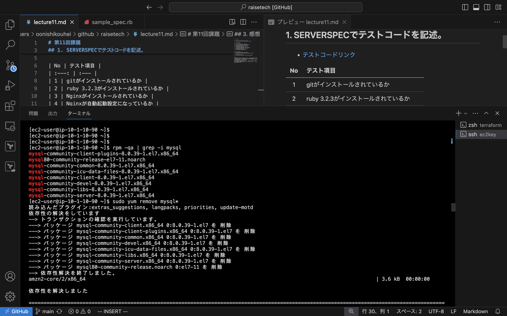
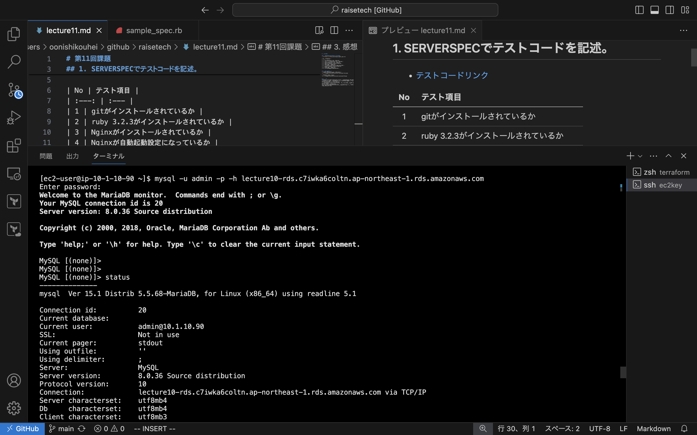
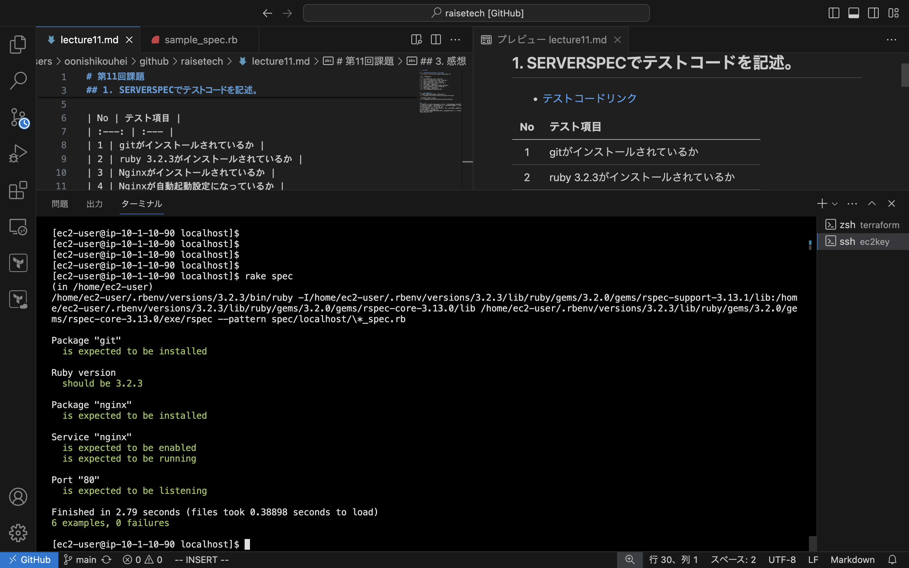

# 第11回課題

## 1. Serverspecでテストコードを記述。
- [テストコードリンク](severspec/sample_spec.rb)

| No | テスト項目 |
| :---: | :--- |
| 1 | gitがインストールされているか |
| 2 | ruby 3.2.3がインストールされているか |
| 3 | Nginxがインストールされているか |
| 4 | Nginxが自動起動設定になっているか |
| 5 | Nginxが実行中であるか |
| 6 | ポート80がリスニング状態にあるかどうか |


## 2. エビデンス画像
- 作成したServerspecのディレクトリツリー  
  

- テストコード実行後の結果  
  


## 3. 指摘箇所修正
- EC2上でMySQLが動作していたため、MySQLをアンインストール。  


- MySQLインストール + MySQLに接続  
```
# MySQLインストール
$ sudo yum install mysql
```


- テストコードのMySQLに関する項目をコメントアウトした後、Serverspecの実行画面を確認  


## 4. 感想
テストコードを作成することで、コマンドを一回ずつ手動で確認しなくても、結果をすぐに把握できるだけでなく、確認漏れを防ぐことができるため、非常に重要なアプリケーションだと感じました。  
また、テストコードは確認項目を簡単に追加したり、削除したりできるので、使い勝手が良いとも感じました。  
コードの記述にはいくつかの違いがあったので、理解を深めるためにさらに調べてみたいと思います。
